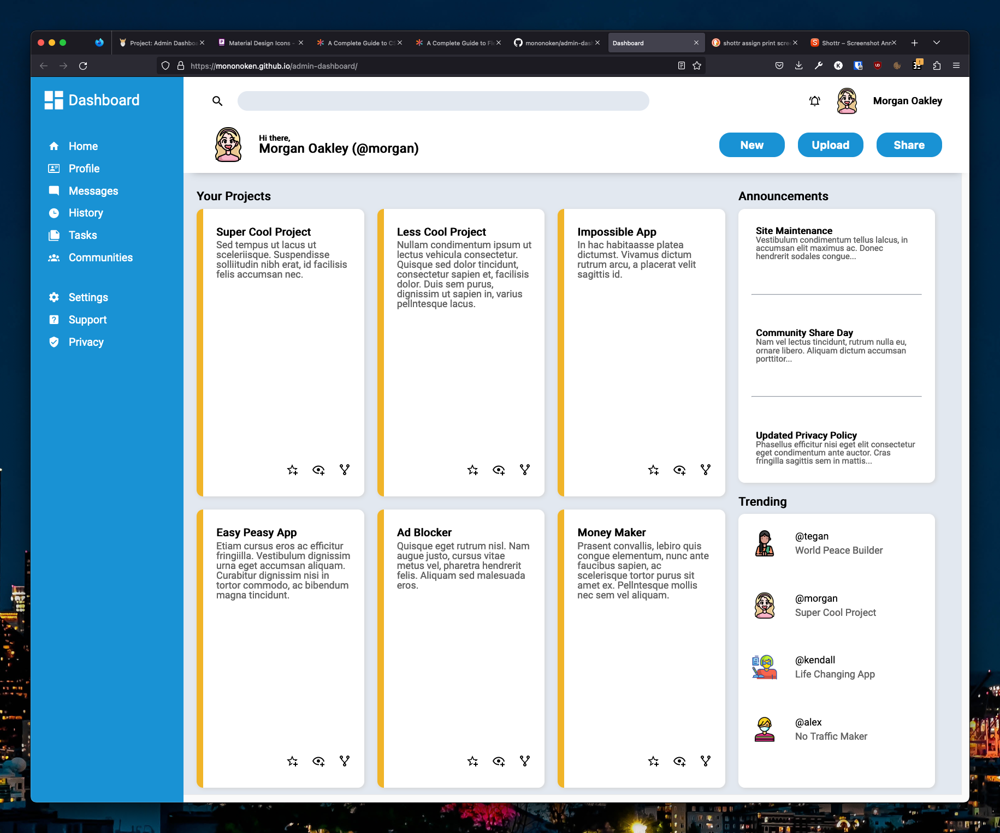

# # Admin Dashboard

This webpage is an admin dashboard template. It utilizes HTML and CSS only.

[Click here to see a live-preview hosted on Github).](https://mononoken.github.io/admin-dashboard/)

## Table of Contents

- [General Information](#general-information)
- [Acknowledgements](#acknowledgements)
- [Reporting Issues / Feedback / Contact](#reporting-issuesfeedbackcontact)

## General Information

This project is the final project of the intermediate HTML and CSS section of The Odin Project. It is an exercise in using various HTML and CSS tools, but it most notably focuses on Grid. There are many nested grids throughout the page. I have also used Flexbox, for example in the "Announcements" card.

## Acknowledgements

- [The Odin Project](https://www.theodinproject.com), my primary guide in the vast sea of web-development learning.
  - For providing this project idea ([see the instructions for this assignment here](https://www.theodinproject.com/lessons/intermediate-html-and-css-admin-dashboard))
  - And the Discord community!
- [Pictogrammers](https://pictogrammers.com/library/mdi/) for the svg symbols.
- [ICONS8](https://icons8.com/icons/set/avatar) for the avatar profile pics.

## Reporting Issues/Feedback/Contact

Bug reports are greatly appreciated. You may create a new issue with a description of the problem, and the steps leading up to it.

PRs are kindly appreciated.

You may also contact me at: mail@feelsufo.com
